# WMI

> Doran Kayoumi, Jérôme Arn

1. Retrouvez les caractéristiques de votre processeur, en utilisant les différents outils installés 

> WMI explorer

| SELECT * FROM Win32_Processor WHERE DeviceID='CPU0' | SELECT * FROM Win32_Processor WHERE DeviceID='CPU1' |
| --------------------------------------------------- | --------------------------------------------------- |
| \\DESKTOP-T3Q31C8\ROOT\CIMV2:Win32_Processor        | \DESKTOP-T3Q31C8\ROOT\CIMV2:Win32_Processor         |
| 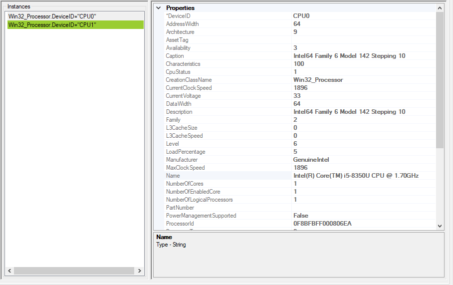                                 | 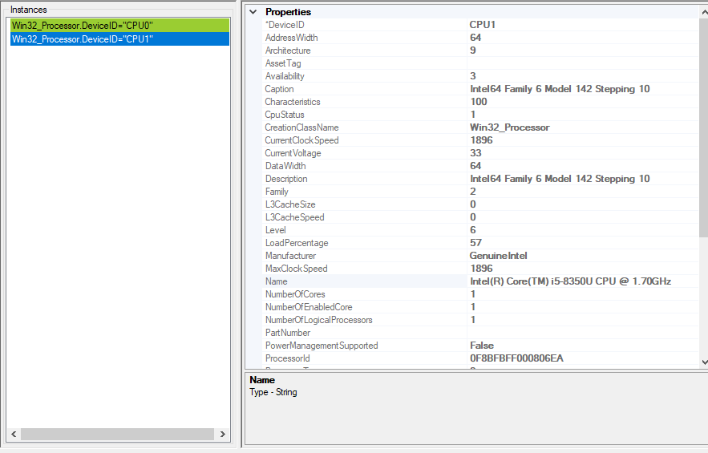                                 |

> WMI Monitor

Une fois la première configuration effectuée, on clique sur le bouton **Browse WMI Counters** et on sélectionne **Win32_Processor** puis les informations que l'on désire obtenir sur le processeur. 

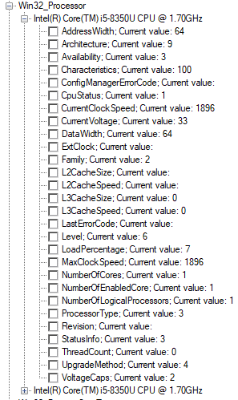

2. Retrouvez le SID de l’utilisateur Administrateur de votre système, en utilisant les différents outils installés

> WMI Monitor

Même chose qu'à la manipulation précédente mais cette fois sur la classe UserAccount.

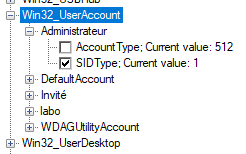

Et on peut constater le résultat dans l'active directory n'est malheureusement pas celui voulu. Avec l'outil WMI monitor (du moins la version gratuite) il n'est pas possible de récupérer le SID de l'utilisateur 

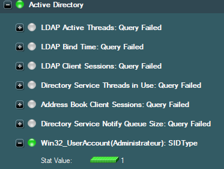

> WMI explorer

| SELECT * FROM Win32_UserAccount WHERE Domain='DESKTOP-T3Q31C8' AND Name='Administrateur' |
| ------------------------------------------------------------ |
| \\DESKTOP-T3Q31C8\ROOT\CIMV2:Win32_UserAccount.Domain        |
| 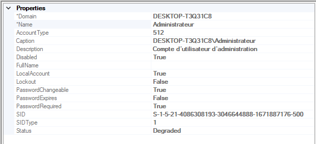                                         |


3. Retrouvez les routes IPv4 de votre système, en utilisant les différents outils installés

> WMI Monitor

Dans cette manipulation on peut sélectionner pour chaque route quel attribut on veut afficher. 

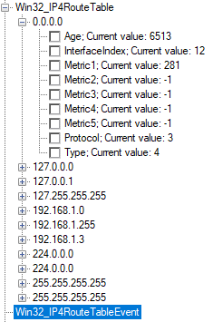


> WMI explorer

| SELECT * FROM Win32_IP4RouteTable                            |
| ------------------------------------------------------------ |
| \\DESKTOP-T3Q31C8\ROOT\CIMV2:Win32_IP4RouteTable.Destination |
| 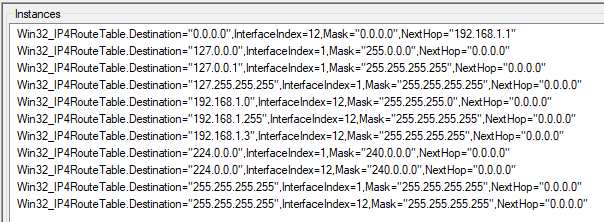                                           |


> wmic

````shell
path win32_IP4RouteTable
````

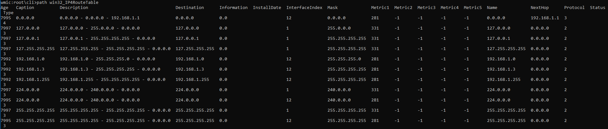


> wbemtest

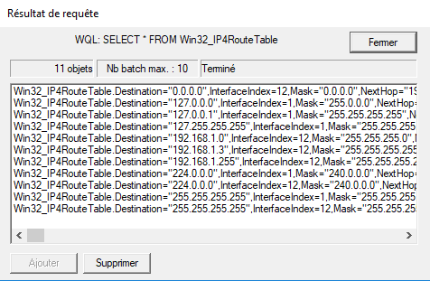


> PowerShell

````powershell
Get-WmiObject -query "SELECT * FROM Win32_IP4RouteTable" | Select-Object Age,Name,Description,Destination
````
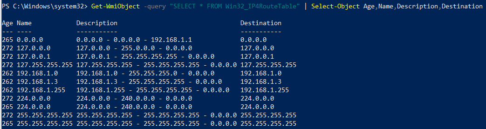
> Note: Nous avons filtré les éléments affichés afin de tout afficher en une seul capture.

4. Toujours depuis la VM Windows A, à l’aide de WMI Monitor, affichez la quantité de mémoire disponible sur la machine Windows B. 

   # Dans le cadre de ce travail, nous sommes partis sur la mémoire du disque dur étant donné que cela n'était pas précisé.

> Pour configurer WinB pour faire des requêtes distantes WMI

Dans l'application **Exécuter** lancer **DCOMCNFG**. Puis dans le menu `Racine de console  > Services de composants > Ordinateurs >  Poste de travail` faites un clique droit `Propriété` et allez sur l'onglet  `Sécurité COM` et ajouter l'utilisateur **labo** et lui ajouter toutes les autorisations.

| Autorisations d'accès | Autorisations d'exécution et d'activation |
| --------------------- | ----------------------------------------- |
| 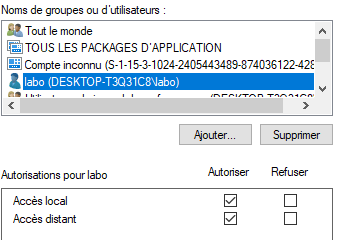      | 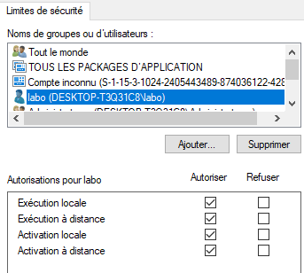                          |

Dans l'application **Exécuter** lancer **wmimgmt.msc**. Puis dans le menu `Racine de la console > Contrôle WMI(local)`   faites un clique droit `Propriété` et allez dans l'onglet `Sécurité` et sélectionné **WMI** puis appuyer sur le bouton `Sécurité` et ajouter l'utilisateur **labo** et lui ajouter toutes les autorisations. Puis ensuite faites un redémarrage de la machine. 

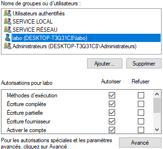

On peut tester sur WMI monitor, sur la machine WinA, et on constate que la liaison s'effectue correctement. 

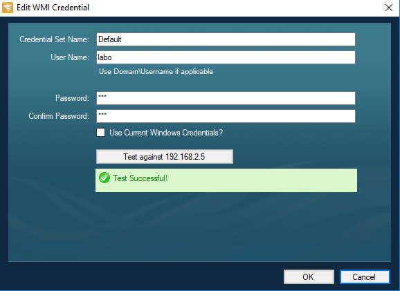

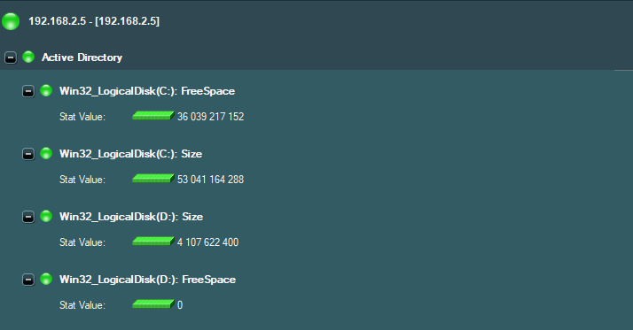

> Montrez le trafic entre la VM Windows A et la VM Windows B à l’aide d’une capture Wireshark.

on peut voire que WMI monitor émet beaucoup de trafic. Ci-dessous la requête d'authentification sur la machine Win B.

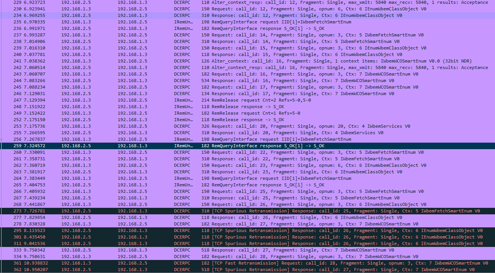

Wmi utilise le protocole **DCERPC** pour effectuer la communication, nous avons filtrer en conséquence sur wireshark.

5. Toujours depuis la VM Windows A, écrivez un script PowerShell qui permette de lister les partitions de la machine Windows B avec leur lettre de lecteur et de retourner le pourcentage d’espace vide.

> En cas d’espace insuffisant, une alarme syslog est générée.

````powershell
# credentials sur la machine WinB
$user = "labo"
$password = "grx" | ConvertTo-SecureString -AsPlainText -Force
$creds = New-Object System.Management.Automation.PSCredential($user, $password)

# Seuil pour le lancement d'alerte 
$threshold = 0.2

# Envoi de la requête et filtrage des informations de la liste de disque
$disks = Get-WmiObject Win32_LogicalDisk -ComputerName 192.168.2.5 -Credential $creds | Select-Object Size,FreeSpace,DeviceID

# iétration pour chaque disque dans la liste
echo("Liste des disques présent:")
ForEach ($disk in $disks){
    # calcul en pourcent de l'espace libre disponible
    $freeSpace = [math]::round($disk.FreeSpace/$disk.Size,2) * 100

    # affichage du disque, de l'espace libre en octets et en %
    echo ("$($disk.DeviceID) libre $($disk.FreeSpace) octets ($($freeSpace)%)")

    if($disk.FreeSpace -lt ($disk.Size * $threshold)){
        # envoi d'un warning (severity = 4) sur la machine WinA (Server 192.168.1.3)
        send-syslog -Server 192.168.1.3 -Severity 4 -Message "Il reste moins de $($threshold * 100)% d'espace sur le disque $($disk.DeviceID)" 
    }
}
````

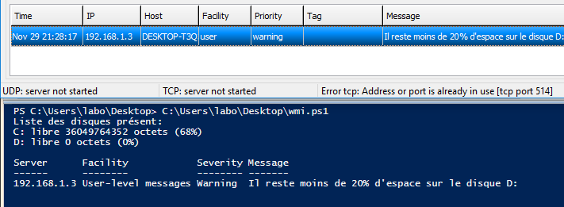

Comme on peut le constater sur la capture, deux disques sont actuellement listés sur la machine WinB. L'un des deux ne possède plus d'espace libre.
